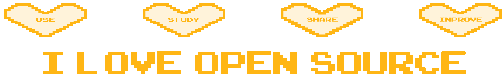

<h1 align="center">Hi  I'm ATOMNFT</h1>
<h3 align="center">As a dedicated tinkerer and designer from the US, I am passionate about creating, building, and rigorously testing innovative solutions.</h3>

I am a professional freelance graphic designer, accomplished artist, and tech enthusiast. I take pride in contributing to the innovative art and technology landscape. Inspired by my mother, a talented traditional artist, I developed a passion for art from an early age. Over the years, I have completed numerous projects for clients, ranging from e-juice companies to barbecue spice companies.

 
 

Beyond my artistic pursuits, I have a deep interest in creating, tinkering, coding, building, and designing tech. My expertise extends to working with Arduino, ESP32, and IoT technologies. I am constantly learning and exploring new ways to integrate art and technology, driving forward both creative and technical advancements.

---
<!--ILOVEOPENSOURCE-->

<h2>⚡️ Git Stats</h2>

  

---

 
  
<h2>📘 Projects I've contributed to</h2>

  <!-- Repo info cards - https://github.com/ATOMNFT/github-readme-stats -->
  <!-- Small repo cards (fork) - https://github.com/ATOMNFT/github-readme-stats -->
	
	

---

# 🔎 **Looking for ESP32 Flasher Tools**

---

## 
 I dabble in, but am still learning these languages 

  
  
  
  
  
  
  
  
 

  

___

  

  

